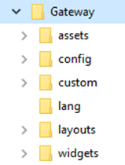
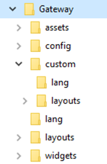
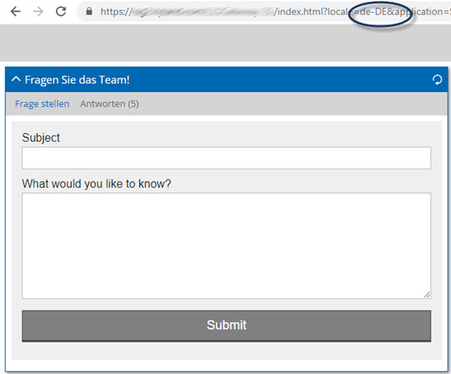
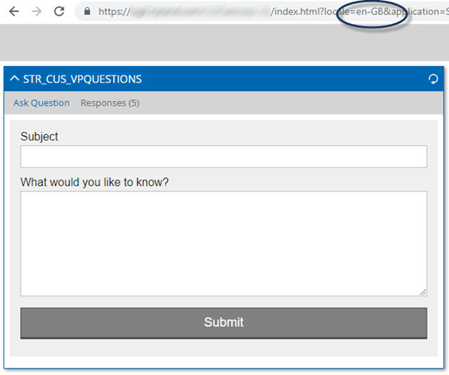

# Multilingual support

The Web Portal Toolkit provides multilingual support. We distinguish between different locales which means that we provide different language files and additional settings based on the language and locale, for instance, German or Austrian German, Spanish or Mexican Spanish. Defaults for date and number formats for each locale are also taken from the browser. The locale can be used in the HTML Content widget to display content based on the logged-in user’s locale. *See FlexQuery*.

### Naming of Language files

Standard language files are called lang-xx-zz.json and custom language files are called customLang-xx-zz.json where xx is a two-character code for the language (e.g. English, Spanish, German) and zz is a two-character code for the country (e.g. United Kingdom, United States, Spain, Mexico).

These locale codes are standard and used by Microsoft and others.

### Location of Language files

Nothing should be modified outside of the config and custom folders of a Gateway. If anything is, you should be prepared for these changes to be potentially lost with an upgrade; these two folders are not included in upgrades. An example of this is the language files.

The language files are stored in two places within the Gateway folder structure:



Standard language files are released in each new version and are stored in the *lang* folder of the Gateway.

These should not be edited.

<br>




Custom language strings should be placed in the *lang* folder within the *custom* folder of the Gateway. These files are not affected by future upgrades.

Strings in this file override the standard files so if you need a custom string to replace the standard one the change should be in this file. For example, the standard string might be “Invoice Number”, but based on user feedback you may want to use “Invoice \#”. You would use the same tag for the string but place it in the custom file. Not only will your string be used now, but also after any upgrades take place.

### Determining the Language file

There is a specific order used to determine the language used for the logged-in user.

1.  URL – if the language code is included in the Gateway URL and the language file is configured, the portal displays in this language.

2.  Browser language – if the URL does not contain a language code, the browser language is used. Each language configured in the browser is evaluated in the order listed. The first language with a configured language file is used.

The user can also select a language from the Landing Page or Home Page side menu.


# Configuring a New Language
## Locale File

The locale file, located under the Gateway’s config folder, contains the languages available to the portal. This file is not overwritten during an upgrade. In our code example, German and English (GB) and English (US) are supported for the portal.

``` py linenums="1"
{
	"Locales": [
		{	
			"LangCode": "de",
			"Active": true,
            "Name": "Deutsch",
            "DefaultCode": "DE",
            "Subcategories": [
				{
                	"Code": "DE",
	                "Active": true,
    	            "Name": "Deutschland"
				}
			]
		},
		{
            "LangCode": "en",
            "Active": true,
            "Name": "English",
            "DefaultCode": "SA",
            "Subcategories": [
                {
                "Code": "GB",
                "Active": true,
                "Name": "United Kingdom"
                },
                {
                "Code": "US",
                "Active": true,
                "Name": "United States"
                }
			]
		}
	]
}
```

| Line      | Setting      | Description                          |
| :-------- | :----------- | :----------------------------------- |
| 2         | Locales      | Each language that the Gateway applications must have available to the end users, must be included in the locale file.  |
| 4         | LangCode      | The standard language code that represents the language.  |
| 5         | Active      | If set to true, the language is available in all of the applications configured for this Gateway. |
| 6         | Name      | The language represented by the language code. This displays on the Home Page side menu; therefore, should be written in the specified language. |
| 7         | DefaultCode      | If a user has a locale (country) that is not included in the Subcategories setting, the default code is used instead. For example, there are portal users in both Germany and Austria. The Austrian users have a locale of de-AT, but AT is not configured as a subcategory in the locale file. In this case, the DefaultCode of DE would be used. |
| 8 – 14         | Subcategories      | This section identifies each language locale configured for use with the Web Portal Toolkit. |
| 10         | Code      | The standard locale or country code with the spelling and formatting as used within the country. |
| 11         | Active      | If true, the code is available for use in the Web Portal Toolkit and displays in the side menu on the Landing Page and Home Page as a sub-category of the main language. |
| 12         | Name      | The locale or country where this language is spoken. |


### Language Strings

Language strings are delivered with both the installation and upgrade files for the Web Portal Toolkit. These files may be updated at any time; therefore we do not recommend modifying these files. In the custom folder, we provide a lang folder where you can place your modified language files. The strings in these files override what is configured in the delivered language files.

### Custom Strings

We recommend when adding custom titles for widgets, that you use “STR_CUS_TITLE” where TITLE is the custom header displayed to the user. For updating text for warnings, messages or buttons, you have to use the same string name as used in the language file. This is because the string names are set by the WPT developers.

# Adding or Updating Language Strings

As mentioned previously, you will never modify the language files located in the Gateway’s lang folder. This folder is delivered in the WPT full installation files as well as the upgrade files. Whether customising a widget title, updating button text or configuring a string for a document type alias, you will do this in custom languages files located in the lang folder under Custom.

## Updating Messages, Warnings or Button Text

When updating text displays for messages, warnings or buttons, you cannot change the string that is used. The string names are set by the WPT developers. For instance, "STR_WPT_FORGOTPW_REQUESTED": "You should receive an email shortly to reset your password.", displays after a user has requested the reset password link. You may wish to modify the text in both German and UK English. Follow these steps:

1.  Open one of your delivered language files. In the example, we used lang-en-GB.json.

2.  Locate the String that you want to change.

```
"STR_WPT_FOLDERNODOCUMENTFOUND": "No document found",
"STR_WPT_FOLDERNOFOLDERFOUND": "No folder found",
"STR_WPT_FOLDERS": "Folders",
"STR_WPT_FORGOT": "Forgot login details",
"STR_WPT_FORGOTPASSWORD": "Forgot Password",
"STR_WPT_FORGOTPW_ERROR_MSG": "Failed to reset forgotten password",
"STR_WPT_FORGOTPW_REQUESTED": "You should receive an email shortly to reset your password.",
"STR_WPT_FORGOTPW_SUBMIT_ERROR_MSG": "Failed to request reset forgotten password",
```

3.  Copy the string

4.  Open customLang-en-GB.json

5.  Copy the string

6.  Replace the message text with

```
"STR_WPT_FORGOTPW_REQUESTED": "You will receive a link to reset your password.",
```

7.  Save the file

8.  Make the same change to customLang-de-DE

9.  Test to verify that your new message displays properly

## Updating Widget Titles

If widget titles are hard coded as a specific value in the widget configuration, the title will always display in the language used to type the title name. In the scenario we have users in Germany and the United Kingdom so we want the widget titles to appear in the appropriate language based on the user’s locale. The Questions widget in English is “Ask the Team!” In German, we want to display, “Fragen Sie das Team!”

1.  There should already be a language string, “STR_WPT_QUESTIONS”, in the delivered language files. You can just copy the string to the German custom language file and rename it as “STR_CUS_QUESTIONS” or you can name your custom language string differently, such as “STR_CUS_VPQUESTIONS”. It is just a matter of preference. I am going to use “STR_CUS_VPQUESTIONS”.

2.  Open customLang-de-DE.json.

3.  Type “STR_CUS_VPQUESTIONS”. Tip: Put the strings in alphabetical order to make them easier to locate.

4.  Enter the German text you wish to display: “Fragen Sie das Team!”

```
{
	"Translate": {
		"STR_CUS_180DAYINV": "Alle Rechnungen der letzten 180 Tage",
		"STR_CUS_ALIASINVOICE": "Rechnung",
		"STR_CUS_ALIASDELNOTICE": "Lieferschein"
		"STR_CUS_EXCEPTIONS": "Ausnahmen",
		"STR_CUS_RESPONSES": "Second example for custom translation",
		"STR_CUS_VENDORDETAILS": "Aktuellste Lieferantendaten",
		"STR_CUS_VPQUESTIONS": "Fragen Sie das Team!",
		"STR_CUS_VPQUICKSEARCH": "Schnelle Suche",
		"STR_CUS_VPUPLOAD": "Rechnungen oder Lieferscheine hochladen"
	}
}
```

Now access the appropriate config_application.json file and search for the Questions widget.
Modify the title to reflect the newly created language string.

```
"Questions": {
	"Instance": [
	{
		"Disabled": false,
		"PlaceHolder": "#PlaceHolder2",
		"Title": "STR_CUS_VPQUESTIONS",
		"Size": "Full",
		"Form": "Question Form",
		"Query": {
		"Name": "Vendor Portal Questions",
		"Keywords": [
		{
			"Name": "Form Status",
			"Value": "COMPLETE"
		}
		]
	}
}
```

To test, log into the portal and from the side menu, change your language to German. The URL locale changes to de-DE and the widget title displays in German.



Access Languages from the Side Menu again and change to a language without the custom language string defined. Notice that the STRING name displays, not the STRING value. This is because the STRING is not defined in the custom language file for the currently displayed language.


